# 📌 Join – A Kanban Project Management Tool

    

   

> **Join** is a modern, Trello-inspired Kanban tool built with **Angular** and **NestJS**.
> It helps individuals and teams **organize tasks**, **visualize workflows**, and **collaborate efficiently** – with a strong focus on clean architecture, interactivity, and a polished user experience.

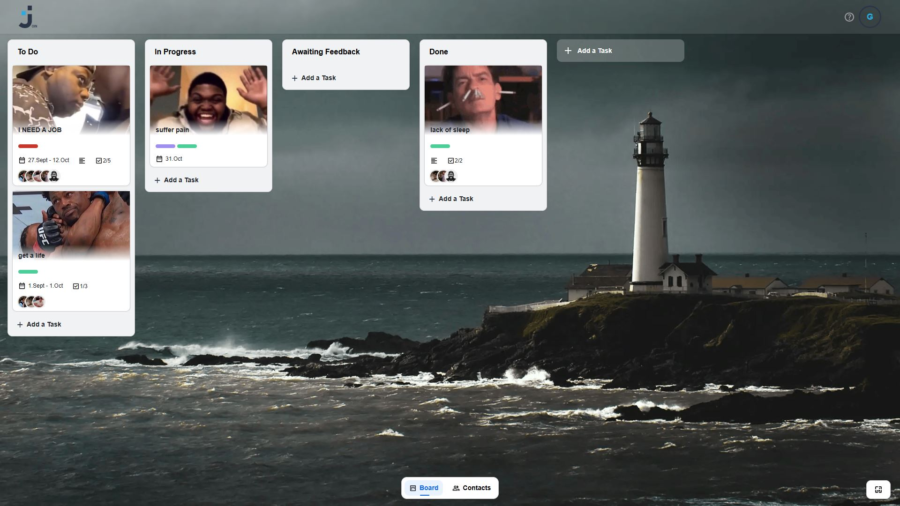

---

## 🚀 Live Demo

👉 **[join.rahmiesen.de](https://join.rahmiesen.de/auth/login)**

---

## 📑 Table of Contents

- [✨ Key Features](#-key-features)
- [🛠 Technology Stack](#-technology-stack)
- [👨‍💻 Author](#-author)

---

## ✨ Key Features

<strong>🔑 Comprehensive Authentication System</strong>

A complete and secure workflow for user management ensures a smooth and safe onboarding experience. The system includes standard registration, Google OAuth, guest access, and a full password reset flow.

| Login Page | Sign Up Page |
| :---: | :---: |
| 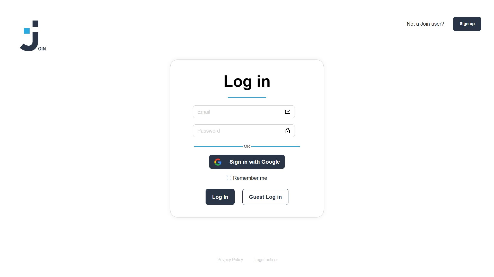 | 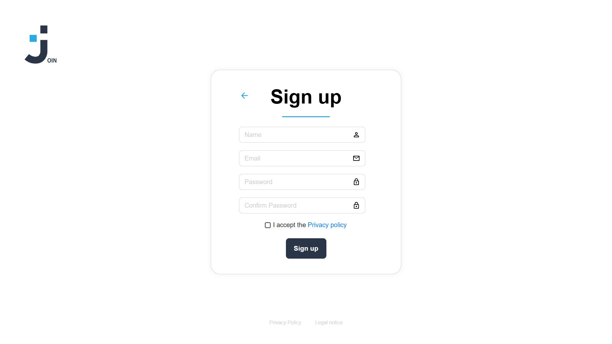 |

#### Seamless Password Reset Flow
The application features a complete, user-friendly, and secure process for password recovery, illustrated below:

<table>
  <tr>
    <td align="center"><strong>1. Login Error & Request</strong></td>
    <td align="center"><strong>2. Email Confirmation</strong></td>
    <td align="center"><strong>3. Received Email</strong></td>
  </tr>
  <tr>
    <td width="33%">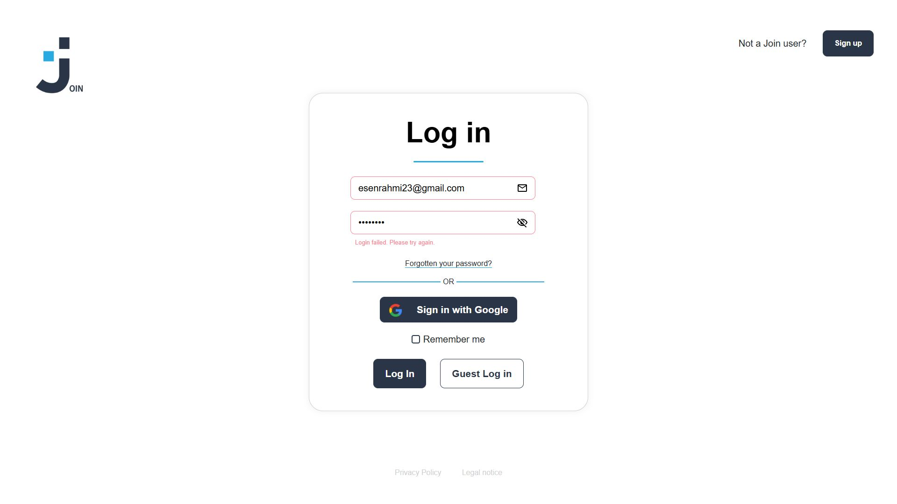</td>
    <td width="33%">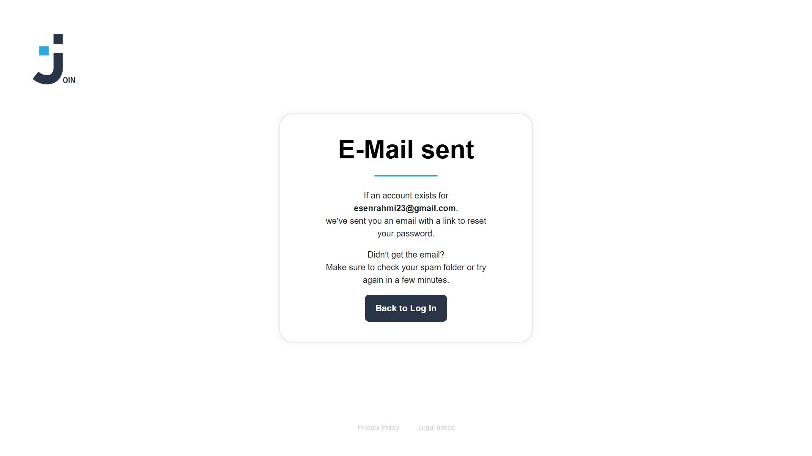</td>
    <td width="33%">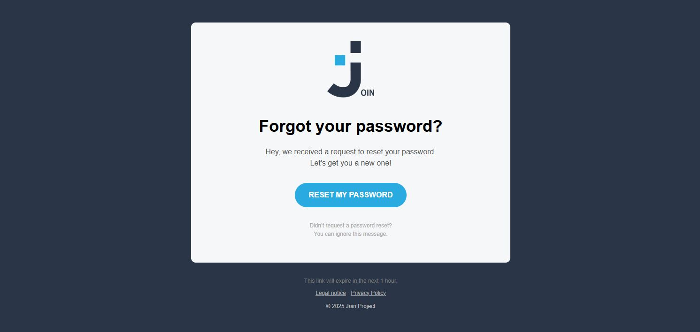</td>
  </tr>
  <tr>
    <td align="center">A "Forgot Password?" link appears after a failed login attempt.</td>
    <td align="center">The user is notified that a reset email has been sent.</td>
    <td align="center">The user receives a secure email with a link to reset their password.</td>
  </tr>
   <tr>
    <td align="center"><strong>4. New Password Form</strong></td>
    <td colspan="2" align="center"><strong>Process Complete</strong></td>
  </tr>
   <tr>
    <td>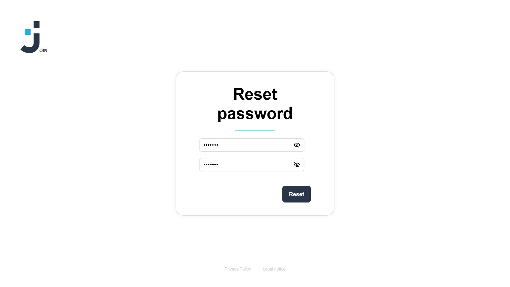</td>
    <td colspan="2">The user sets a new password, completing the secure reset cycle.</td>
  </tr>
</table>

<strong>📋 Interactive Kanban Board</strong>

The core of Join is an interactive board that provides an intuitive, visual way to manage workflows, built with the power of the **Angular Component Dev Kit (CDK)**. The following workflow demonstrates the core interactions.

---

### Board Interaction Workflow

<table>
  <tr>
    <td width="50%" valign="middle">
      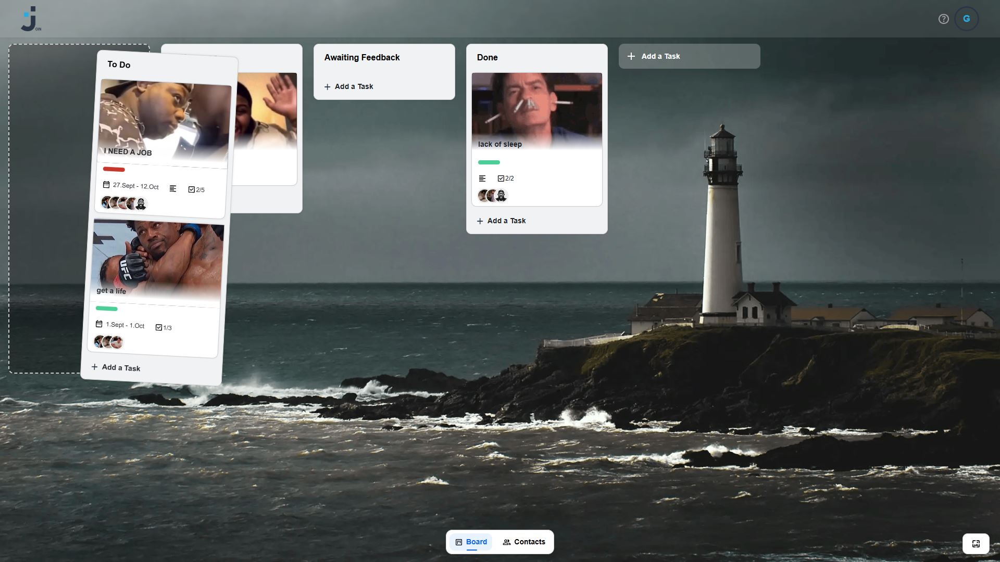
    </td>
    <td width="50%" valign="middle">
      <h3>1. Reorder Lists via Drag & Drop</h3>
      
Users can intuitively change the order of the lists to match their workflow.

    </td>
  </tr>
  <tr>
    <td width="50%" valign="middle">
      <h3>2. Use the List Context Menu</h3>
      
Alternatively, each list provides a context menu for more precise actions.

    </td>
    <td width="50%" valign="middle">
      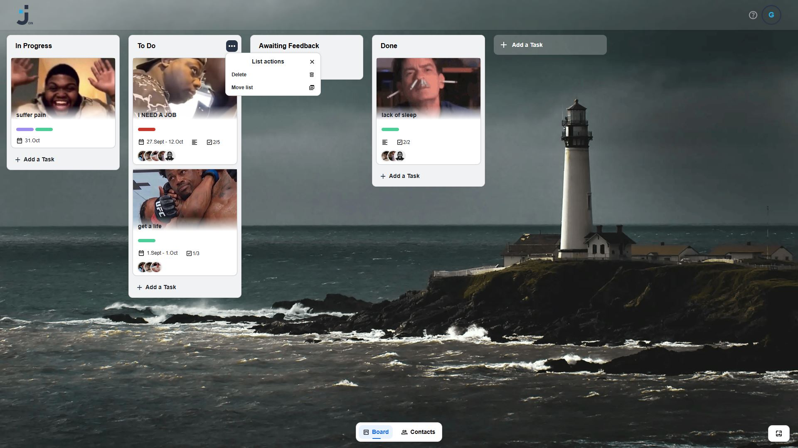
    </td>
  </tr>
  <tr>
    <td width="50%" valign="middle">
      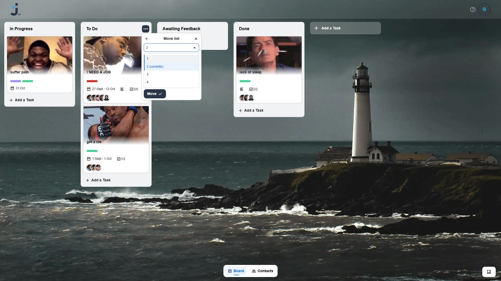
    </td>
    <td width="50%" valign="middle">
      <h3>3. Move a List via Menu</h3>
      
From the menu, users can move a list to a specific position, which is ideal for touch devices.

    </td>
  </tr>
  <tr>
    <td width="50%" valign="middle">
      <h3>4. Add a New List</h3>
      
New columns can be added directly on the board via an inline form.

    </td>
    <td width="50%" valign="middle">
      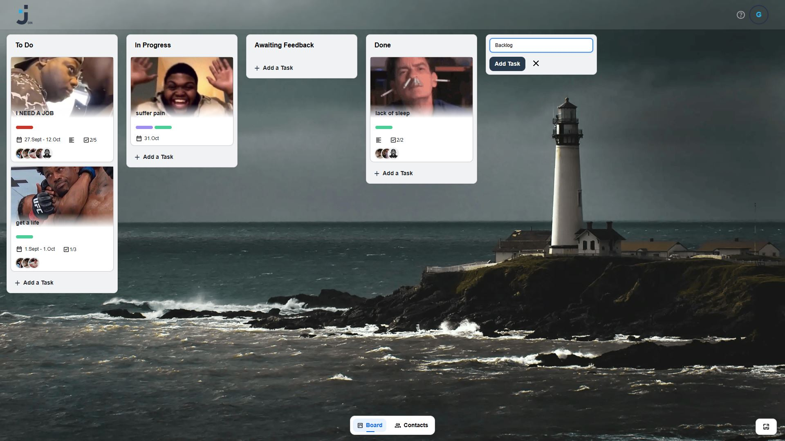
    </td>
  </tr>
    <tr>
    <td width="50%" valign="middle">
      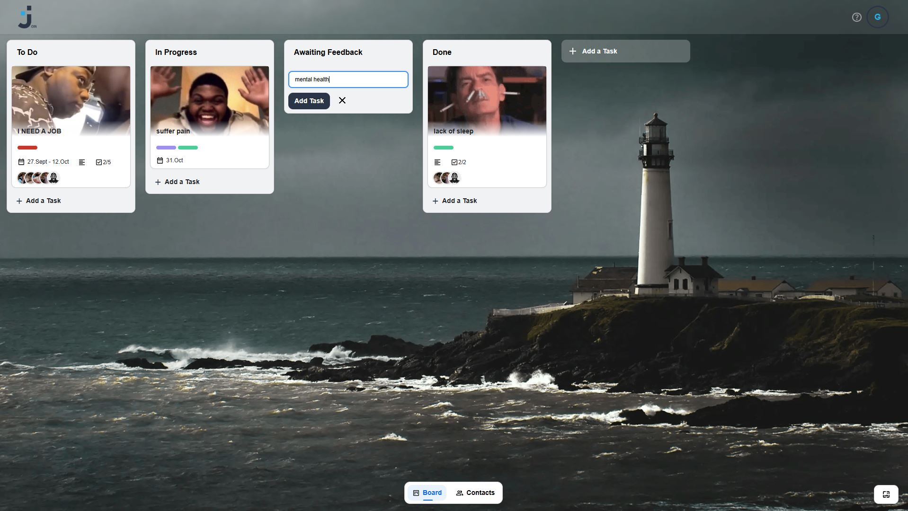
    </td>
    <td width="50%" valign="middle">
      <h3>5. Add a New Card</h3>
      
Quick-add forms within each list allow for the fast creation of new tasks.

    </td>
  </tr>
  <tr>
    <td width="50%" valign="middle">
      <h3>6. Move Cards via Drag & Drop</h3>
      
A card's status is updated by simply dragging it to a new list.

    </td>
    <td width="50%" valign="middle">
      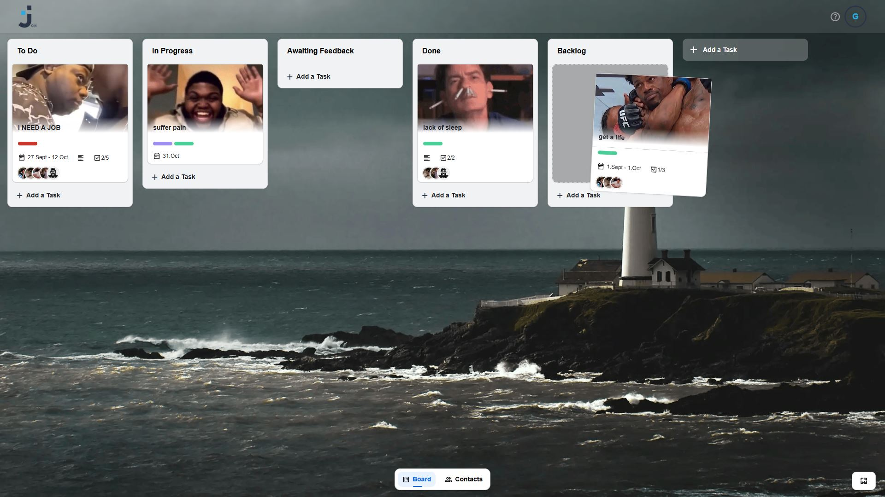
    </td>
  </tr>
  <tr>
    <td width="50%" valign="middle">
      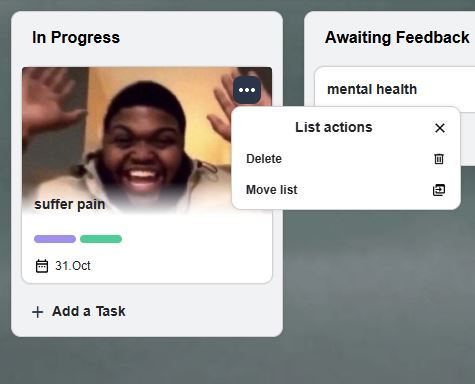
    </td>
    <td width="50%" valign="middle">
      <h3>7. Use the Card Context Menu</h3>
      
Each card also has its own menu for quick actions like moving or deleting.

    </td>
  </tr>
    <tr>
    <td width="50%" valign="middle">
      <h3>8. Move or Delete a Card</h3>
      
The menu allows for precise control over a card's position or for its deletion.

    </td>
    <td width="50%" valign="middle">
      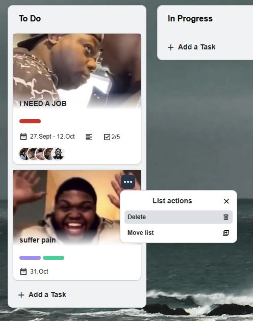
    </td>
  </tr>
</table>

<strong>📝 The Feature-Rich Task Editor</strong>

Clicking a task opens a powerful modal editor that offers granular control over every detail. This editor is not just a form, but a collection of highly interactive and feature-complete components designed for a seamless user experience.

---

### 🎨 Cover Customization Workflow

The editor allows for rich visual customization of each task card through an intuitive cover menu.

<table>
  <tr>
    <td width="50%" valign="middle">
      <h3>1. Opening the Cover Menu</h3>
      
The journey begins by opening the task. A dedicated button in the header opens the cover menu, presenting all customization options.

    </td>
    <td width="50%" valign="middle">
      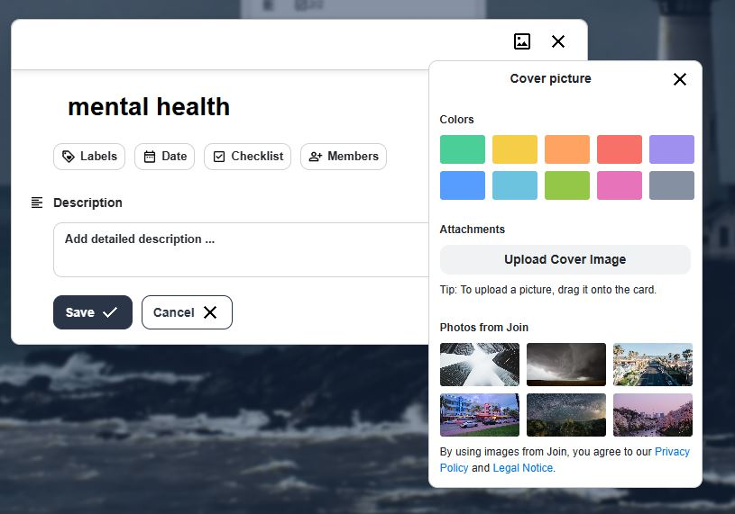
    </td>
  </tr>
  <tr>
    <td width="50%" valign="middle">
      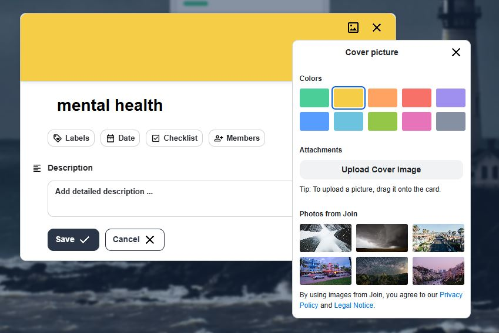
    </td>
    <td width="50%" valign="middle">
      <h3>2. Applying a Solid Color</h3>
      
Users can choose from a vibrant palette of solid colors to categorize or highlight a task. The change is instantly reflected in the header.

    </td>
  </tr>
  <tr>
    <td width="50%" valign="middle">
      <h3>3. Choosing a Stock Photo</h3>
      
A curated library of professional stock photos is available to give tasks a more visual and descriptive background.

    </td>
    <td width="50%" valign="middle">
      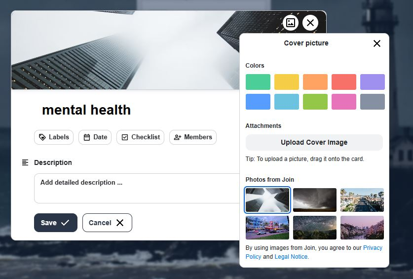
    </td>
  </tr>
  <tr>
    <td width="50%" valign="middle">
      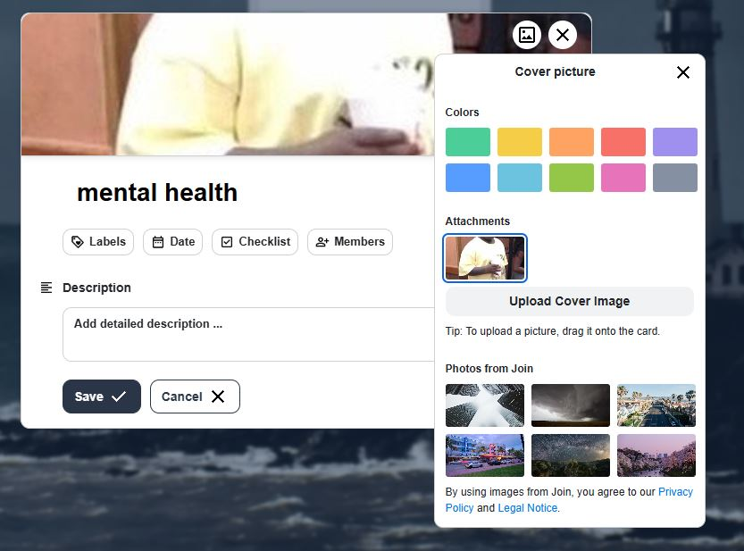
    </td>
    <td width="50%" valign="middle">
      <h3>4. Using Uploaded Attachments</h3>
      
Any image previously uploaded to the task is available in the "Attachments" section and can be reused as a cover with a single click.

    </td>
  </tr>
</table>

---

### ⚙️ Managing Task Details

The editor provides a suite of modular tools to manage labels, dates, members, and sub-tasks.

<table>
  <tr>
    <td width="50%" valign="middle">
      <h3>1. Full Label Management</h3>
      
An integrated tool allows users to create, edit, delete, and assign colored labels from a feature-rich dropdown menu.

    </td>
    <td width="50%" valign="middle">
      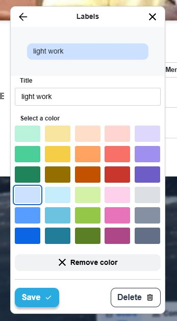
    </td>
  </tr>
  <tr>
    <td width="50%" valign="middle">
      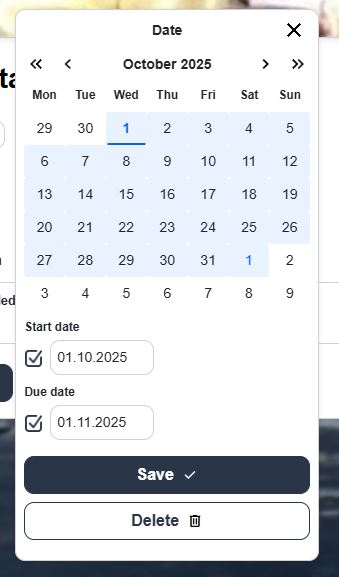
    </td>
    <td width="50%" valign="middle">
      <h3>2. Custom Date Picker</h3>
      
A custom-built, interactive calendar component provides an intuitive way to select a start date, a due date, or a date range.

    </td>
  </tr>
  <tr>
    <td width="50%" valign="middle">
      <h3>3. Member Assignment</h3>
      
Team members can be easily assigned to a task by selecting them from a clean, searchable list of all project contacts.

    </td>
    <td width="50%" valign="middle">
      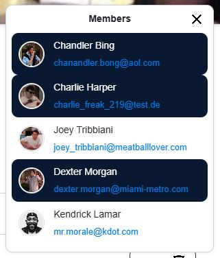
    </td>
  </tr>
  <tr>
    <td width="50%" valign="middle">
      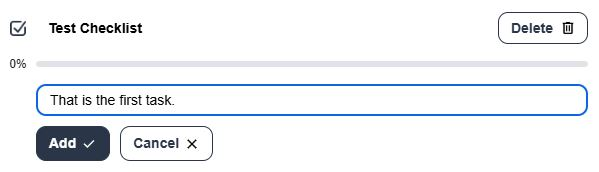
    </td>
    <td width="50%" valign="middle">
      <h3>4. Interactive Checklists</h3>
      
Break down tasks into smaller, manageable sub-tasks. New items can be added via a simple inline form.

    </td>
  </tr>
  <tr>
    <td width="50%" valign="middle">
      <h3>5. Checklist Progress Tracking</h3>
      
As items are completed, a color-coded progress bar and percentage display provide immediate visual feedback on the checklist's status.

    </td>
    <td width="50%" valign="middle">
      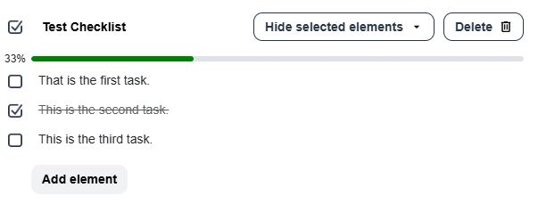
    </td>
  </tr>
</table>

---

### ✍️ Rich Text Editor Workflow (Tiptap.dev)

A complete rich text editor is integrated for task descriptions, offering a wide range of powerful formatting options.

<table>
  <tr>
    <td width="50%" valign="middle">
      <h3>1. Headings & Structure</h3>
      
Users can structure their content with a full range of heading levels from H1 to H6, or revert to normal paragraph text.

    </td>
    <td width="50%" valign="middle">
      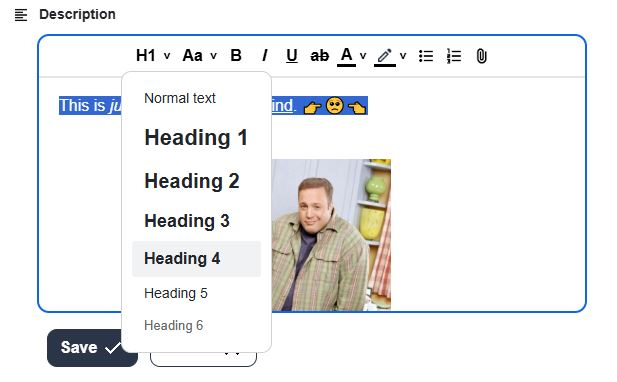
    </td>
  </tr>
  <tr>
    <td width="50%" valign="middle">
      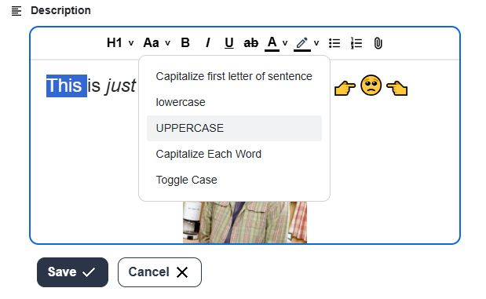
    </td>
    <td width="50%" valign="middle">
      <h3>2. Advanced Text Transformation</h3>
      
A unique and powerful feature allows for transforming selected text to UPPERCASE, lowercase, Capitalized, and more.

    </td>
  </tr>
  <tr>
    <td width="50%" valign="middle">
      <h3>3. Text Color & Highlighting</h3>
      
Extensive color palettes for both font color and background highlighting give users full creative control over the text appearance.

    </td>
    <td width="50%" valign="middle">
      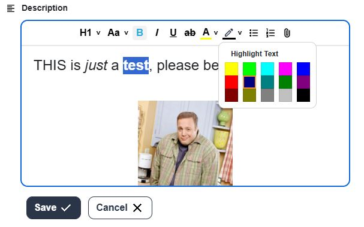
    </td>
  </tr>
  <tr>
    <td width="50%" valign="middle">
      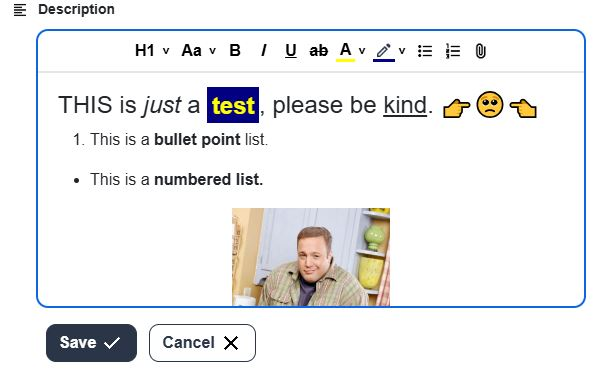
    </td>
    <td width="50%" valign="middle">
      <h3>4. Full Formatting Suite</h3>
      
The editor supports all standard formatting, including bold, italics, lists, and the ability to embed images directly within the description.

    </td>
  </tr>
</table>

<strong>📇 Full-Fledged Contact Management</strong>

Join includes a comprehensive contact management system with a dedicated responsive design, allowing for full CRUD functionality in an intuitive interface.

<table>
  <tr>
    <td width="50%" valign="middle">
      <h3>1. Organized Overview</h3>
      
The main view presents a clean, alphabetically sorted list of all contacts. The list is intelligently grouped by the first initial, making navigation through long lists effortless.

    </td>
    <td width="50%" valign="middle">
      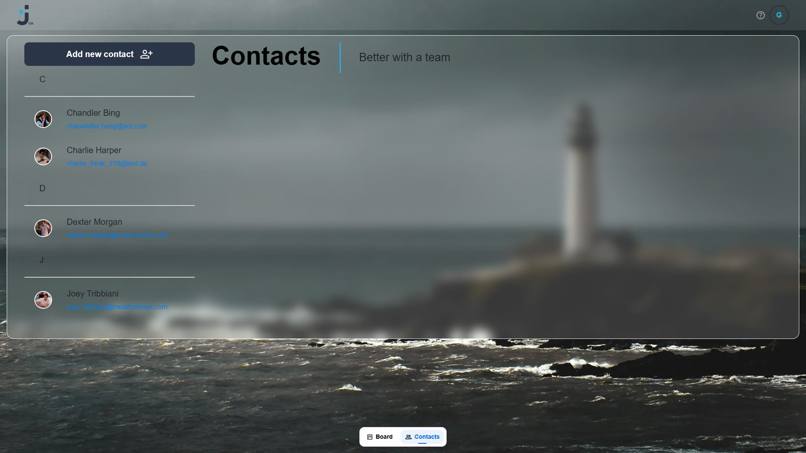
    </td>
  </tr>
  <tr>
    <td width="50%" valign="middle">
      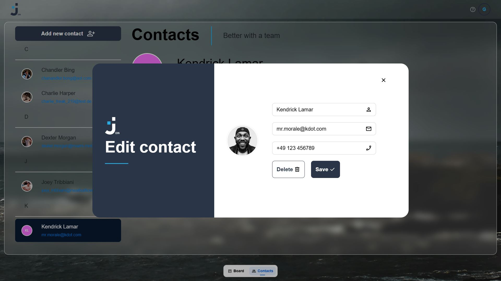
    </td>
    <td width="50%" valign="middle">
      <h3>2. Create & Edit via Modal</h3>
      
A beautifully animated modal slides in for adding and editing contacts (from the side on desktop, from the bottom on mobile). It features a live preview for profile picture uploads and robust form validation.

    </td>
  </tr>
  <tr>
    <td width="50%" valign="middle">
      <h3>3. Detailed View & Feedback</h3>
      
After creating or editing, the user is presented with the detailed contact view and a smooth success notification. The layout is a classic master-detail view on desktop and a screen-by-screen flow on mobile.

    </td>
    <td width="50%" valign="middle">
      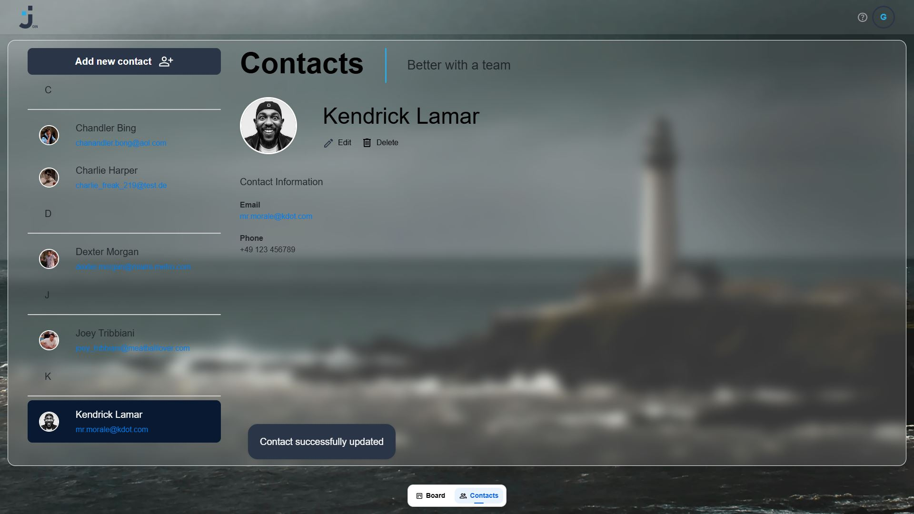
    </td>
  </tr>
</table>

<strong>🎨 Workspace Customization</strong>

To enhance the user experience, Join includes a board personalization feature. The selected background is saved to the user's profile and is automatically applied upon their next login.

<table>
  <tr>
    <td align="center"><strong>1. Open Widget</strong></td>
    <td align="center"><strong>2. Select a Color</strong></td>
    <td align="center"><strong>3. Select an Image</strong></td>
  </tr>
  <tr>
    <td width="33%">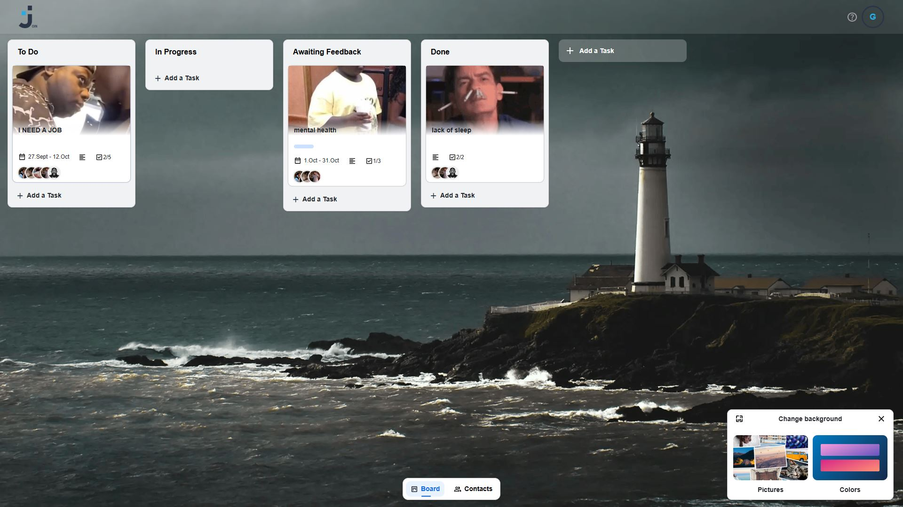</td>
    <td width="33%">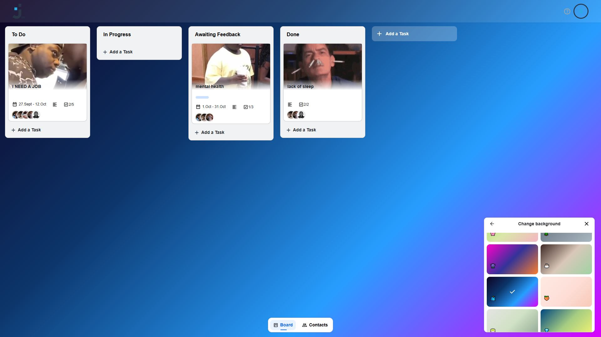</td>
    <td width="33%">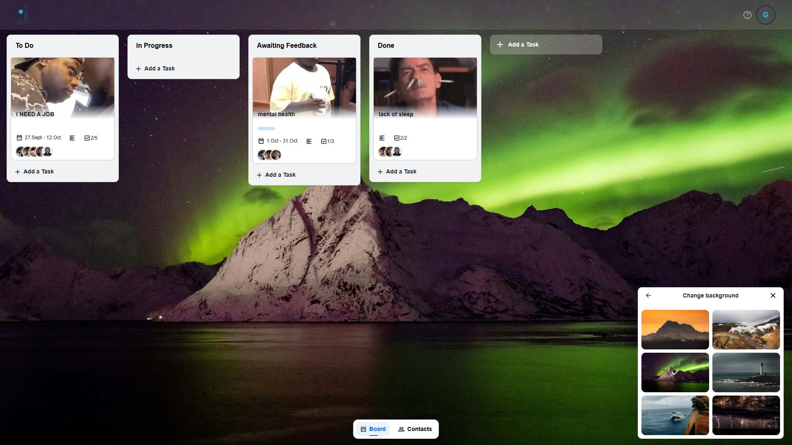</td>
  </tr>
  <tr>
    <td align="center">An elegant, floating widget provides access to all options.</td>
    <td align="center">Choose from a modern palette of vibrant gradient backgrounds.</td>
    <td align="center">Or select from a curated library of high-quality images.</td>
  </tr>
</table>

<strong>📱 Responsive & Mobile-First Design</strong>

The application is designed to be fully functional and user-friendly across all devices, demonstrating a deep understanding of responsive principles.

-   **Smart Layout Adaptation:** The UI intelligently adapts its layout for major components, such as the Kanban board (horizontal scroll), the contact page (master-detail vs. single screen), and editor modals (side-slide vs. bottom-slide).
-   **Optimized Touch Experience:** On mobile, drag-and-drop is strategically disabled in favor of context menus to ensure a smooth and conflict-free scrolling experience.

---

## 🛠 Technology Stack

-   **Frontend:** **Angular**
    -   Written in **TypeScript**, utilizing modern features like **Standalone Components**.
    -   **Reactive Forms** for robust and testable form logic.
    -   **Angular CDK** for professional drag-and-drop functionality and custom overlays.
    -   **Angular Router** for a seamless single-page application (SPA) experience.
-   **Backend:** **NestJS** + **Prisma** + **PostgreSQL**
-   **Authentication:** **JWT**
-   **Rich Text Editor:** **Tiptap.dev**
-   **Styling:** **SCSS** with a modular, component-based structure

---

## 👨‍💻 Author

**Rahmi Esen**

  
